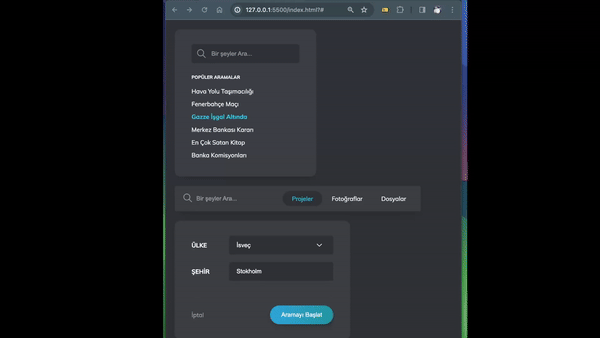

# Search Project

Bu proje, kullanıcıların arama yapmalarını ve arama sonuçlarını filtrelemelerini sağlayan bir web uygulamasını içermektedir. Aşağıda projenin temel bileşenleri ve yapıları hakkında bilgi bulabilirsiniz:

## Bileşenler

### 1. Search Component

Bu bileşen, temel arama işlevselliğini içerir. Kullanıcılar bir metin girişi yapabilir ve popüler aramaları görebilirler. Bileşen, görsel bir arama simgesi ve popüler aramaları listeleme özelliği ile kullanıcı dostu bir arayüz sunar.

### 2. Filtered Search Component

Bu bileşen, kullanıcıların aramalarını belirli kategorilere göre filtrelemelerine olanak tanır. Kullanıcılar arama terimini girebilir ve aynı zamanda projeler, fotoğraflar veya dosyalar arasında seçim yapabilirler. Bileşen, kullanıcıya çeşitli seçenekler sunan bir arayüzle zenginleştirilmiştir.

### 3. Filter Component

Bu bileşen, daha spesifik arama kriterlerini içerir. Kullanıcılar ülke ve şehir gibi filtreleri kullanarak arama sonuçlarını daraltabilirler. Bileşen, kullanıcı dostu bir arayüzle filtre seçeneklerini sunar.

## Kullanılan Teknolojiler

- HTML
- CSS
- JavaScript
- Özel ikonlar ve görseller
- Harici kütüphaneler (CSS ve JS dosyaları)
  
## Nasıl Kullanılır?

1. Ana sayfada temel arama bileşenini kullanarak genel aramalar yapabilirsiniz.
2. Filtreli arama bileşenini kullanarak arama sonuçlarını belirli kategorilere göre filtreleyebilirsiniz.
3. Filtre bileşenini kullanarak daha spesifik arama kriterleri belirleyebilir ve arama sonuçlarını daraltabilirsiniz.

## Kurulum

Projeyi kendi bilgisayarınıza kurmak için aşağıdaki adımları izleyin:

1. Depoyu bilgisayarınıza klonlayın.
2. Projenin ana dizinindeki `index.html` dosyasını bir web tarayıcısında açın.

## Ekran Görüntüsü

